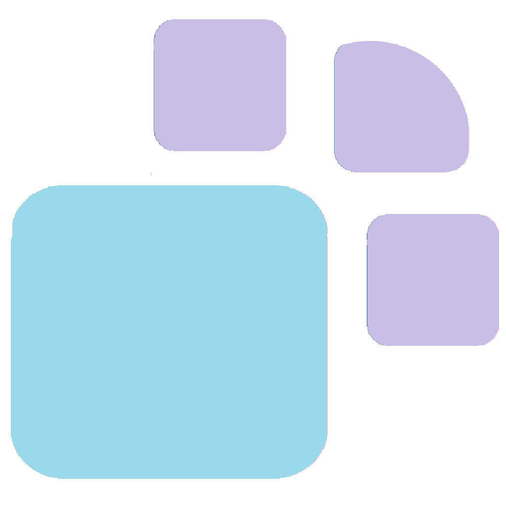

&nbsp;&nbsp;&nbsp;&nbsp;&nbsp;&nbsp;&nbsp;&nbsp;&nbsp;&nbsp;&nbsp;&nbsp;&nbsp;&nbsp;&nbsp;&nbsp;&nbsp;&nbsp;&nbsp;&nbsp;

# Paw - 桌面 AI Agent

Paw 是一个基于 Electron 的使用TypeScript+Python打造的桌面级桌面 AI Agent 应用平台，支持文件操作、终端控制、Web 搜索等丰富的工具链，并具备会话管理、记忆系统和 Skill 扩展能力。。

## 特性

- **Electron 桌面应用**：原生桌面体验，自动管理 Python 后端，内置虚拟环境
- **丰富的工具链**：
  - 文件操作：读取、创建、编辑、删除文件
  - 目录搜索：按名称搜索、grep 内容搜索
  - 异步终端：run_command 执行命令，支持中断
  - Web 搜索：DuckDuckGo 搜索 + Jina Reader 网页阅读
- **会话管理**：自动保存对话历史，支持多会话切换
- **Skill 系统**：用户可在 `~/.paw/skills/` 自定义扩展能力
- **上下文管理**：智能管理 64K+ tokens 大窗口上下文
- **记忆系统**（可选）：基于 RAG 的对话记忆检索

## 快速开始（开发环境）

```bash
# 1. 安装 Node 依赖
npm install

# 2. 构建 Python 环境（paw_env）
#    Paw 使用官方 Python embeddable 包，不依赖系统已安装的 Python
#    按以下步骤手动构建：

#    a. 下载 Python 3.13.x embeddable 包（Windows）：
#       https://www.python.org/ftp/python/3.13.5/python-3.13.5-embed-amd64.zip
#       解压到项目根目录的 paw_env/ 文件夹

#    b. 删除 paw_env/ 下的 python313._pth 文件（必须删除，否则模块路径解析异常）

#    c. 安装 pip：
#       下载 https://bootstrap.pypa.io/get-pip.py
#       在 paw_env/ 目录下执行：
cd paw_env
python.exe ..\get-pip.py --no-warn-script-location
cd ..

#    d. 安装项目依赖：
paw_env\python.exe -m pip install -r src\backend\requirements.txt --no-warn-script-location

# 3. 启动开发模式
npm start
```

> **为什么用 embeddable 包而不是普通 venv？**
> 普通 venv 的 `python.exe` 依赖创建时的 Python 安装路径（硬编码在 `pyvenv.cfg`），
> 打包后在其他电脑上路径不存在会直接崩溃。embeddable 包完全自包含，解压即用。

## 打包安装

打包后的应用内置完整 Python 环境，用户无需安装 Python 即可使用。

```bash
# 确保已按上述步骤构建好 paw_env，然后：

# Windows
npm run build:win

# macOS
npm run build:mac

# Linux
npm run build:linux
```

安装包输出到 `release/` 目录，约 150-200MB。

## 内置指令

| 指令 | 说明 |
|------|------|
| `/new` | 开始新对话 |
| `/sessions` | 显示会话列表 |
| `/load <id>` | 恢复指定会话 |
| `/delete-session <id>` | 删除会话 |
| `/model` | 重新选择模型 |
| `/clear` | 清空对话历史 |
| `/edit` | 进入对话编辑模式 |
| `/memory` | 查看记忆状态 |
| `/ctx` | 手动触发上下文优化 |
| `/stop` | 停止当前生成 |

## 项目结构

```
Paw/
├── src/                    # 所有源代码
│   ├── main/              # Electron 主进程
│   │   ├── main.ts        # 主进程入口
│   │   └── preload.ts     # 预加载脚本
│   │
│   ├── renderer/          # 前端渲染进程
│   │   ├── app.ts         # 前端主逻辑
│   │   ├── modules/       # 功能模块
│   │   └── types/         # TypeScript 类型定义
│   │
│   └── backend/           # Python 后端
│       ├── paw.py         # 主程序入口
│       ├── config.yaml    # 配置文件
│       ├── tools.py       # 基础工具（文件/终端/Web）
│       ├── tool_definitions.py  # 工具 Schema 定义
│       ├── tool_registry.py     # 工具注册中心
│       ├── chunk_system.py      # 上下文管理
│       ├── context_branch.py    # 上下文分支编辑
│       ├── branch_executor.py   # 分支执行器
│       ├── memory.py            # 记忆系统
│       ├── session_manager.py   # 会话管理
│       ├── prompts.py           # 提示词配置
│       ├── call.py              # LLM API 客户端
│       ├── ui_web.py            # Web UI 服务
│       └── terminal.py          # 异步终端管理
│
├── resources/             # 资源文件
│   ├── icons/            # 应用图标
│   ├── templates/        # HTML 模板
│   └── static/           # 静态资源（CSS、字体）
│
├── dist/                # TypeScript 编译输出
├── release/             # 应用打包输出
├── paw_env/             # Python embeddable 环境（不提交 git）
├── package.json         # Node.js 配置
├── tsconfig.json        # TypeScript 配置
└── src/backend/requirements.txt  # Python 依赖
```

## 依赖

**Python 依赖** (`src/backend/requirements.txt`):
- pyyaml, colorama, requests
- fastapi, uvicorn, websockets, aiohttp
- ddgs（DuckDuckGo 搜索）、beautifulsoup4、html2text
- llama-cpp-python（本地 embedding 记忆系统）
- numpy, jinja2, filelock, fsspec, packaging, tqdm, regex, cachetools

**Node.js 依赖** (package.json):
- electron, electron-builder
- js-yaml, typescript

## Paw记忆意图判断机制

Paw 采用了一种创新的**记忆意图判断机制**，这种机制能在 RAG 检索前先以几乎无成本的方式判断用户问题是否需要记忆系统参与历史回忆。有效地规避了原native RAG机制响应延迟大、过度检索导致的信息冗余、记忆注入破坏对话连贯性等问题。

#### 具体来说
Paw的记忆系统会预计算一个"回忆意图锚点向量 B"，描述"回忆型问题"的语义特征：

```
用户输入 → 计算 embedding → 与 B 比较相似度
                              ↓
                    相似度 < 阈值 → 跳过记忆系统的回忆阶段（如"今天天气怎么样"）
                    相似度 ≥ 阈值 → 触发 RAG 检索（如"之前说的那个函数"）
```

## License

MIT License
